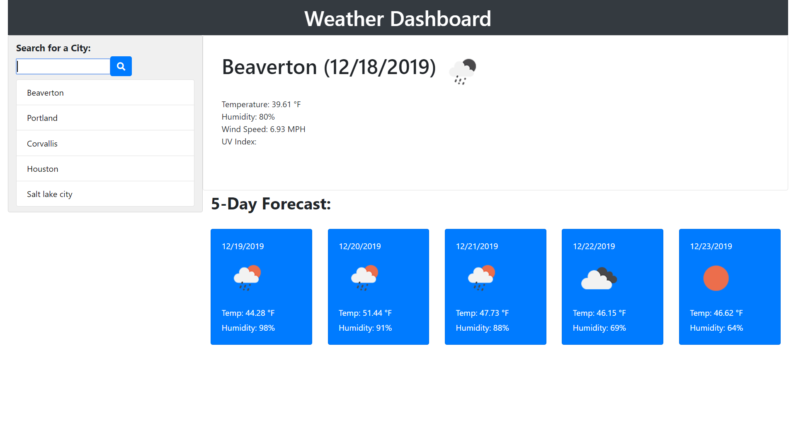

-HomeWork 6-

-WEATHER DASHBOARD-
=

Weather dashboard that lets user input any city name and it will display the current real-time weather data such as temperature, humidity, wind-speed and UV index. It also displays a 5-day forecast and will update and change if you enter in a new city name. Each city you enter will diplay in a group list as a previous history of what you entered before.

Link to deployed site => https://anil1992-rgb.github.io/Weather-DashBoard

Usage
=

Use your mouse to navigate around the page and click and type to interact with the buttons and input fields.

Credits
=

*Google 
*w3schools.com
*github.com
*stackoverflow.com

-----------------------------------------------------------------

